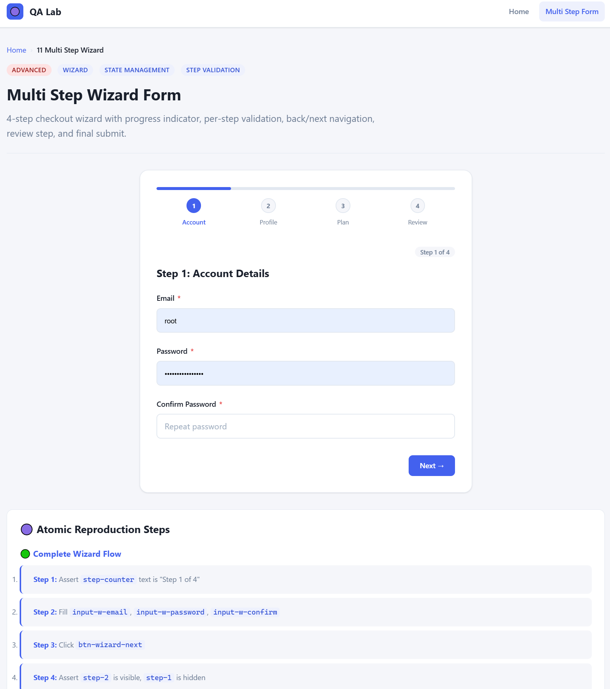
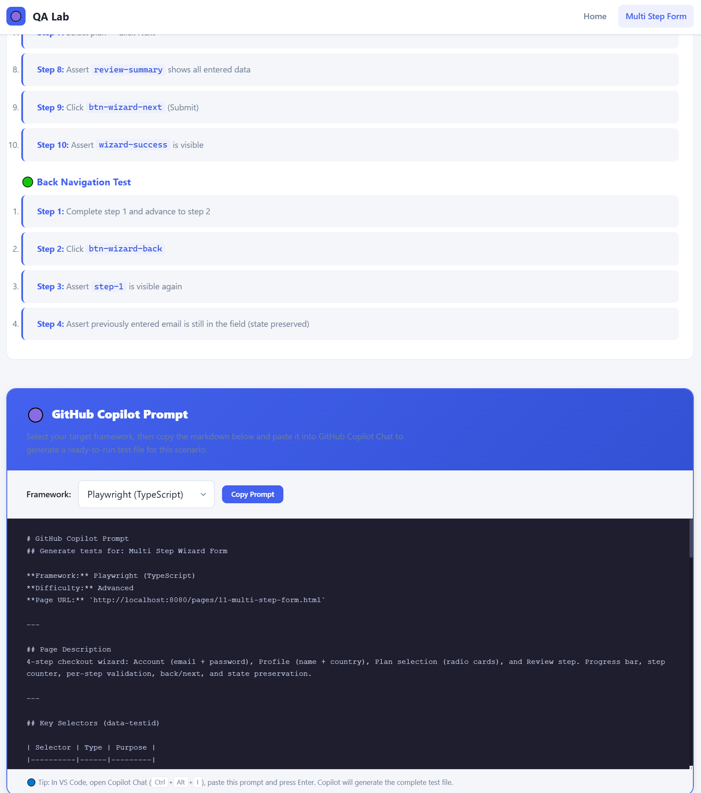

### If you like this project please give it a "Start" or "fork it"

This will push me with more projects and endeavors

# QA Lab E2E Automation Training Platform

### No server required. Just unzip and open in your browser.

> A complete, dependency-free E2E automation training website with 20 progressive test scenarios, from beginner form
> interactions to expert-level Shadow DOM, iFrames, race conditions, and accessibility challenges.
>
> Plain HTML · Plain CSS · Plain Vanilla JavaScript · Zero dependencies · No build step · No npm install · No server
> required. Just unzip and open in your browser.
>
> Built-in **AI Copilot Panels** on every page let you generate, heal, and expand test suites using GitHub Copilot,
> Claude, ChatGPT, or any LLM, making it the ideal playground for AI-assisted test automation and framework training.

---

## 🔵 Purpose

QA Lab is an open source training platform designed for:

- **Personal learning** practice automation techniques in isolation
- **Onboarding** help junior QA engineers learn from day one
- **Interview preparation** demonstrate automation skills on real scenarios
- **Framework comparison** test the same scenarios in different frameworks
- **Automation workshops** structured, progressive lab exercises
- **AI-assisted test generation** every scenario includes proper step-by-step resolution with clear, developer-friendly
  structure and built-in AI-friendly prompt panels. Use GitHub Copilot, Claude, or ChatGPT to generate, heal, and expand
  tests instantly
- **AI framework training** every scenario is designed with predictable, well-structured steps that make it easy to
  teach your own AI agent or LLM the patterns and conventions of your test framework using real, reproducible cases

---

## 📸 Screenshot


---

## 🟡 Folder Structure

```
qa-training-site/
├── index.html                  # Landing page / scenario catalog
├── css/
│   ├── base.css                # Reset, variables, typography, utilities
│   ├── components.css          # Buttons, forms, cards, modals, tables
│   └── layout.css              # Header, nav, grid, page layout, responsive
├── js/
│   ├── utils.js                # Toast, Modal, Tabs, Validate, Store, delay()
│   └── nav.js                  # Navigation helper
├── pages/
│   ├── 01-simple-login.html    # Beginner: login form
│   ├── 02-registration-form.html
│   ├── 03-checkboxes-radios.html
│   ├── 04-dropdowns-selects.html
│   ├── 05-static-content.html
│   ├── 06-dynamic-table.html   # Intermediate: sortable, paginated
│   ├── 07-modals-toasts.html
│   ├── 08-tabs-accordions.html
│   ├── 09-form-validation.html
│   ├── 10-search-filter.html
│   ├── 11-multi step-form.html # Advanced: wizard
│   ├── 12-async-loading.html
│   ├── 13-drag and drop.html
│   ├── 14-file-upload.html
│   ├── 15-localstorage-state.html
│   ├── 16-nested-iframes.html  # Expert: iframes
│   ├── 17-shadow-dom.html
│   ├── 18-race-conditions.html
│   ├── 19-canvas-interactions.html
│   └── 20-accessibility.html
├── assets/                     # Icons, images (if any)
├── docs/
│   ├── README.md               # This file
│   ├── CONTRIBUTING.md         # Contribution guide
│   ├── TESTING_GUIDE.md        # Framework-specific testing guide
│   └── project-history.md      # Change log and architecture decisions
└── metadata/
    └── scenarios.json          # Machine-readable scenario metadata
```

---

## 🟢 Running Locally

### Method 1 Double-click (simplest)

```
Open qa-training-site/index.html in any modern browser.
```

No build step. No npm install. No server required.

### Method 2 Local server (recommended for iframe support)

```bash
# Python
python -m http.server 8080

# Node.js (npx)
npx serve .

# VS Code Live Server extension
# Right-click index.html → Open with Live Server
```

Then navigate to: `http://localhost:8080`

---

## 🚀 Quick Guide for Developers and QA Automation Engineers

### 1. Get the project running

```
1. Download or clone the repository
2. Unzip if needed
3. Open index.html in any modern browser
4. Done. No installs, no setup, no config files.
```

For scenarios that use iFrames (page 16) or require reliable same-origin behaviour, spin up a local server:

```bash
python -m http.server 8080
# or
npx serve .
```

Then open: `http://localhost:8080`

---

### 2. Understand the project layout

| Path | What it is |
|------|-----------|
| `index.html` | Landing page listing all 20 scenarios with difficulty badges and links |
| `landing.html` | Alternative entry point with a visual overview of the platform |
| `pages/01-*.html` to `pages/20-*.html` | The 20 individual scenario pages your tests will target |
| `css/base.css` | Global reset, CSS variables, typography and utility classes |
| `css/components.css` | All reusable UI components: buttons, forms, cards, modals, tables |
| `css/layout.css` | Header, nav, grid system, page structure and responsive breakpoints |
| `js/utils.js` | Shared helpers: Toast, Modal, Tabs, form validation, localStorage store, delay() |
| `js/nav.js` | Navigation state and routing between pages |
| `js/copilot-prompts.js` | Data driving the AI Copilot Panels on each scenario page |
| `js/copilot-render.js` | Renders the collapsible AI Copilot Panel UI on each page |
| `metadata/scenarios.json` | Machine-readable metadata for all 20 scenarios (id, title, difficulty, tags) |
| `docs/` | Full documentation: contributing guide, testing guide, project history |

---

### 3. Anatomy of a scenario page

Every page in `pages/` follows the same structure:

```
Header / Nav
  Scenario title and difficulty badge
  Short description of what the page does and what makes it interesting to test

Main content area
  The actual UI under test (forms, tables, modals, drag-and-drop, etc.)
  Every interactive element has a data-testid attribute

Step-by-step resolution panel (developer-friendly)
  Clear numbered steps describing what a passing test should do
  Expected outcomes for each step
  Notes on timing, async behaviour and edge cases

AI Copilot Panel (collapsible)
  Page summary in plain English
  Full list of available data-testid selectors and their roles
  Suggested test scenarios (happy path, error paths, edge cases)
  Copy-ready prompt to paste into GitHub Copilot, Claude or ChatGPT
```

---

### 4. Using data-testid selectors in your tests

Every interactive element across all 20 pages has a `data-testid` attribute. This is the recommended locator strategy:

```js
// Playwright
await page.getByTestId('login-username').fill('admin');
await page.getByTestId('login-submit').click();

// Selenium (Python)
driver.find_element(By.CSS_SELECTOR, '[data-testid="login-username"]').send_keys('admin')

// Cypress
cy.get('[data-testid="login-username"]').type('admin')

// WebdriverIO
$('[data-testid="login-submit"]').click()
```

Selector priority recommended by this project:

```
data-testid  >  ARIA role  >  visible text  >  CSS class  >  XPath
```

---

### 5. Using the AI Copilot Panel

Every scenario page has a collapsible **"🤖 AI / Copilot Prompts"** section at the bottom:

```
1. Open a scenario page (e.g. pages/01-simple-login.html)
2. Scroll to the AI Copilot Panel and expand it
3. Read the page summary and available selectors
4. Click "Copy Prompt"
5. Paste into GitHub Copilot Chat, Claude, ChatGPT or your preferred LLM
6. Get back a complete, runnable test file for your framework
7. Iterate: ask the AI to add edge cases, switch framework, or heal a broken selector
```

The panel content is also available programmatically via `js/copilot-prompts.js`, so AI agents and scripts can read all scenario context directly without opening a browser.

---

### 6. Pointing your framework at the site

| Framework | Recommended base URL config |
|-----------|---------------------------|
| Playwright | `baseURL: 'http://localhost:8080'` in `playwright.config.ts` |
| Cypress | `baseUrl: 'http://localhost:8080'` in `cypress.config.js` |
| Selenium | Set `driver.get('http://localhost:8080/pages/01-simple-login.html')` |
| WebdriverIO | `baseUrl: 'http://localhost:8080'` in `wdio.conf.js` |
| Robot Framework | `${BASE_URL}` variable set to `http://localhost:8080` |

For file-based access (no server), use the full file path:

```
file:///C:/path-to-project/pages/01-simple-login.html
```

Note: iFrame scenarios (page 16) require a local server for same-origin policy to work correctly.

---

### 7. Key conventions to know before writing tests

| Convention | Detail |
|-----------|--------|
| `data-testid` on every element | All inputs, buttons, links, rows and interactive widgets are tagged |
| ARIA roles and labels | All components use correct ARIA so `getByRole()` works in Playwright |
| Deterministic test data | Fixed usernames, passwords and values so assertions are reproducible |
| Intentional imperfections | Some pages have intentionally bad selectors, timing delays or flaky behaviour by design for training purposes |
| LocalStorage usage | Pages 15 and others persist state in localStorage. Clear it between test runs to avoid bleed |
| Async patterns | Spinners, retries and delayed responses are real. Always use framework auto-wait, never hardcode `sleep()` |

---

## 🔴 Scenario Difficulty Map

| #  | Scenario            | Difficulty      | Key Concepts                   |
|----|---------------------|-----------------|--------------------------------|
| 01 | Simple Login        | 🟢 Beginner     | Form, submit, error messages   |
| 02 | Registration        | 🟢 Beginner     | Multi-field, password confirm  |
| 03 | Checkboxes & Radios | 🟢 Beginner     | Check state, indeterminate     |
| 04 | Dropdowns           | 🟢 Beginner     | Native select, custom widget   |
| 05 | Static Content      | 🟢 Beginner     | Text assertions, attributes    |
| 06 | Dynamic Table       | 🟡 Intermediate | Sort, paginate, filter, delete |
| 07 | Modals & Toasts     | 🟡 Intermediate | Overlay, focus, dismiss        |
| 08 | Tabs & Accordions   | 🟡 Intermediate | ARIA, keyboard nav             |
| 09 | Form Validation     | 🟡 Intermediate | Debounce, async check          |
| 10 | Search & Filter     | 🟡 Intermediate | Debounce search, empty state   |
| 11 | Multi Step Wizard   | 🔴 Advanced     | State, step validation         |
| 12 | Async Loading       | 🔴 Advanced     | Spinner, retry, waitFor        |
| 13 | Drag & Drop         | 🔴 Advanced     | HTML5 DnD, Kanban              |
| 14 | File Upload         | 🔴 Advanced     | setInputFiles, progress        |
| 15 | LocalStorage        | 🔴 Advanced     | Storage, evaluate()            |
| 16 | Nested iFrames      | 🟣 Expert       | frameLocator chaining          |
| 17 | Shadow DOM          | 🟣 Expert       | Web Components, pierce         |
| 18 | Race Conditions     | 🟣 Expert       | Timing, flakiness, stale       |
| 19 | Canvas              | 🟣 Expert       | Coordinates, mouse events      |
| 20 | Accessibility       | 🟣 Expert       | ARIA, roles, focus trap        |

---

## 🟣 Suggested Automation Frameworks

All scenarios are tested to work with:

| Framework              | Language                  | Notes                                        |
|------------------------|---------------------------|----------------------------------------------|
| **Playwright**         | TS / JS / Python / Java   | Recommended best Shadow DOM + iFrame support |
| **Selenium WebDriver** | Python / Java / C# / Ruby | Classic choice all scenarios supported       |
| **Cypress**            | JS / TS                   | File upload & iframes need plugins           |
| **WebdriverIO**        | JS / TS                   | Full W3C, supports shadow via pierce         |
| **Robot Framework**    | Python                    | Use SeleniumLibrary or PlaywrightLibrary     |
| **Appium WebView**     | JS / Java                 | Load in WebView for mobile testing           |

---

## 🔵 Learning Roadmap

### Phase 1 Foundations (Scenarios 01 to 05)

- Master form interactions
- Learn reliable locator strategies
- Practice text and attribute assertions

### Phase 2 Dynamic UI (Scenarios 06 to 10)

- Handle dynamic DOM changes
- Work with tables, modals, tabs
- Understand debounce and async timing

### Phase 3 Complex Interactions (Scenarios 11 to 15)

- Build multi step test flows
- Handle file uploads and local storage
- Work with async patterns and waitFor

### Phase 4 Expert Challenges (Scenarios 16 to 20)

- Master iFrame context switching
- Pierce Shadow DOM
- Diagnose and fix flaky tests
- Test canvas and accessibility

---

## 🤖 AI-Friendly Copilot Panel

Every scenario page includes a dedicated **AI Copilot Panel**, a structured section designed to help developers use AI
assistants (GitHub Copilot, Claude, ChatGPT, or any LLM) to:

- **Generate tests from scratch**: the panel describes the page behaviour, available `data-testid` attributes, and
  expected outcomes in plain language, giving the AI everything it needs to write a first-pass test suite
- **Heal broken tests**: when a selector or flow changes, paste the panel content into your AI chat to get updated,
  corrected tests instantly
- **Learn a new framework**: ask the AI to rewrite the generated tests in Playwright, Cypress, Selenium, or Robot
  Framework using the panel as context
- **Expand coverage**: prompt the AI with edge cases listed in the panel to generate negative, boundary, and
  accessibility tests automatically

### How it works

Each page exposes a collapsible **"🤖 AI / Copilot Prompts"** section containing:

| Element                      | Purpose                                                                               |
|------------------------------|---------------------------------------------------------------------------------------|
| **Page summary**             | One-paragraph description of what the page does                                       |
| **Available selectors**      | Full list of `data-testid` values and their roles                                     |
| **Suggested test scenarios** | Happy path, error paths, edge cases in plain English                                  |
| **Copy-ready prompt**        | A pre-written prompt you can paste directly into Copilot Chat, Claude, or any AI tool |

### Example workflow

```
1. Open any scenario page (e.g. 01-simple-login.html)
2. Expand the "🤖 AI / Copilot Prompts" panel
3. Click "Copy Prompt"
4. Paste into GitHub Copilot Chat / Claude / ChatGPT
5. Receive a complete, runnable test file for your framework of choice
6. Iterate: ask the AI to add edge cases, change framework, or fix a selector
```

> 💡 **Tip:** The panels are also machine-readable. Point an AI agent directly at the page HTML and it can extract all
> test context without any manual copying.

---

## 🔵 Automation Best Practices (Demonstrated)

1. **Stable selectors** `data-testid` > ARIA roles > text > CSS > XPath
2. **Never hardcode waits** always use `waitForSelector` or framework auto-wait
3. **Clear localStorage** before tests that depend on storage state
4. **Assert behavior, not implementation** visible/hidden not display value
5. **Chain frameLocator** for nested iframe traversal
6. **Auto-pierce shadow** Playwright handles open shadow automatically

---

## 🟣 Architecture Decisions

- **No frameworks** Zero-dependency to ensure longevity and portability
- **CSS custom properties** Centralised design tokens in `base.css`
- **data-testid on every interactive element** Framework-agnostic locator strategy
- **ARIA attributes** Support `getByRole()` in Playwright
- **Deterministic data** Fixed test data allows reproducible assertions
- **Intentional imperfections** Some pages have bad selectors and timing issues by design

---

*Generated: 2026-05-15 | Version: 1.0.0*

---

## 📸 More Screenshots





