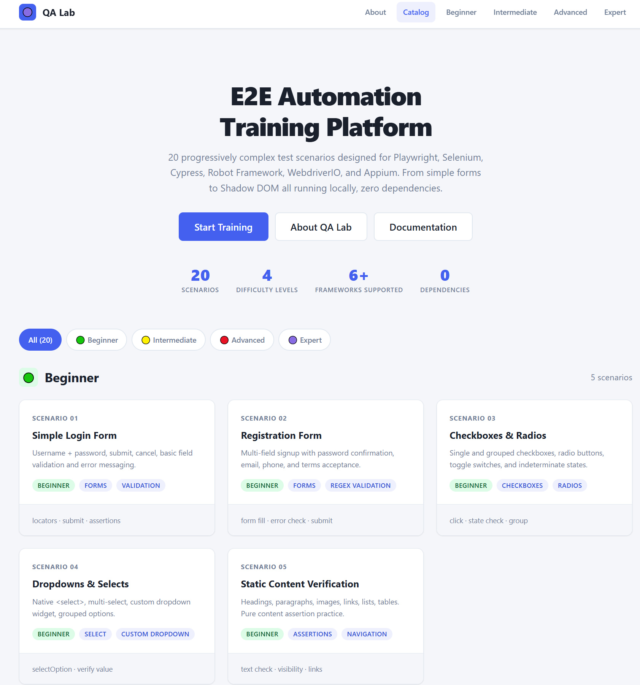
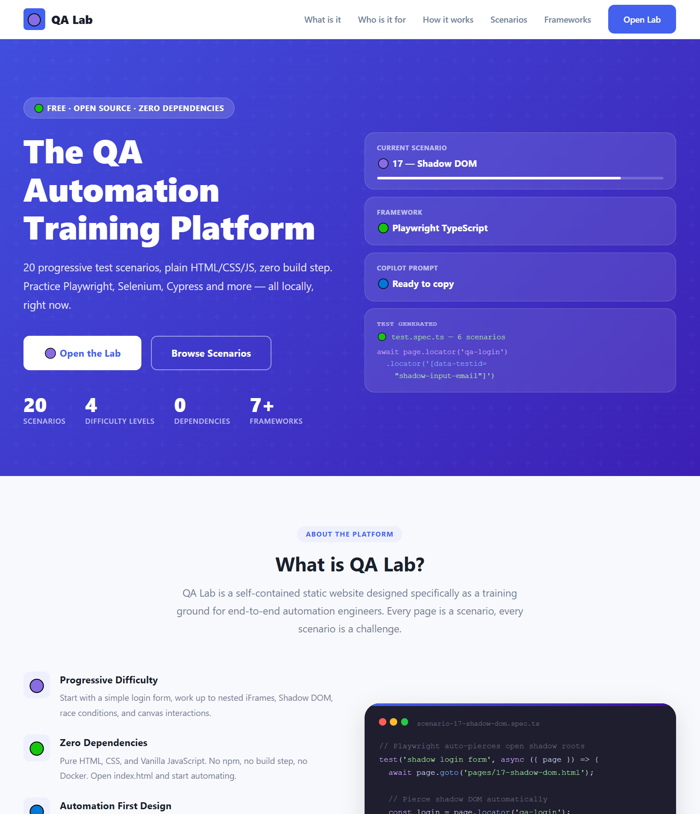
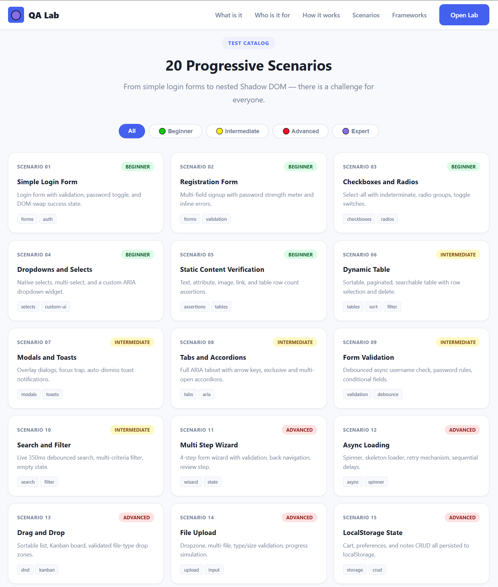
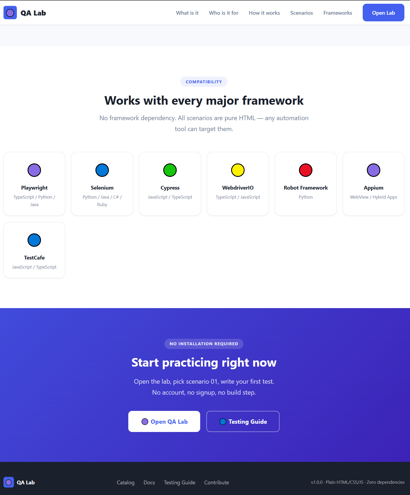

# If you like this project please give it a "Start" or "fork it" at your will
 
This will push me with more projects and endeavours

 # QA Lab E2E Automation Training Platform

> A complete, dependency-free E2E automation training website with 20 progressive test scenarios.
> Plain HTML · Plain CSS · Plain Vanilla JavaScript · Zero dependencies · Runs locally.

---

## 🔵 Purpose

QA Lab is an open source training platform designed for:

- **Personal learning** practice automation techniques in isolation
- **Onboarding** help junior QA engineers learn from day one
- **Interview preparation** demonstrate automation skills on real scenarios
- **Framework comparison** test the same scenarios in different frameworks
- **Automation workshops** structured, progressive lab exercises

---

## 📸 Screenshots






---

## 🟡 Folder Structure

```
qa-training-site/
├── index.html                  # Landing page / scenario catalog
├── css/
│   ├── base.css                # Reset, variables, typography, utilities
│   ├── components.css          # Buttons, forms, cards, modals, tables
│   └── layout.css              # Header, nav, grid, page layout, responsive
├── js/
│   ├── utils.js                # Toast, Modal, Tabs, Validate, Store, delay()
│   └── nav.js                  # Navigation helper
├── pages/
│   ├── 01-simple-login.html    # Beginner: login form
│   ├── 02-registration-form.html
│   ├── 03-checkboxes-radios.html
│   ├── 04-dropdowns-selects.html
│   ├── 05-static-content.html
│   ├── 06-dynamic-table.html   # Intermediate: sortable, paginated
│   ├── 07-modals-toasts.html
│   ├── 08-tabs-accordions.html
│   ├── 09-form-validation.html
│   ├── 10-search-filter.html
│   ├── 11-multi step-form.html # Advanced: wizard
│   ├── 12-async-loading.html
│   ├── 13-drag and drop.html
│   ├── 14-file-upload.html
│   ├── 15-localstorage-state.html
│   ├── 16-nested-iframes.html  # Expert: iframes
│   ├── 17-shadow-dom.html
│   ├── 18-race-conditions.html
│   ├── 19-canvas-interactions.html
│   └── 20-accessibility.html
├── assets/                     # Icons, images (if any)
├── docs/
│   ├── README.md               # This file
│   ├── CONTRIBUTING.md         # Contribution guide
│   ├── TESTING_GUIDE.md        # Framework-specific testing guide
│   └── project-history.md      # Change log and architecture decisions
└── metadata/
    └── scenarios.json          # Machine-readable scenario metadata
```

---

## 🟢 Running Locally

### Method 1 Double-click (simplest)
```
Open qa-training-site/index.html in any modern browser.
```
No build step. No npm install. No server required.

### Method 2 Local server (recommended for iframe support)
```bash
# Python
python -m http.server 8080

# Node.js (npx)
npx serve .

# VS Code Live Server extension
# Right-click index.html → Open with Live Server
```
Then navigate to: `http://localhost:8080`

---

## 🔴 Scenario Difficulty Map

| # | Scenario | Difficulty | Key Concepts |
|---|----------|------------|--------------|
| 01 | Simple Login | 🟢 Beginner | Form, submit, error messages |
| 02 | Registration | 🟢 Beginner | Multi-field, password confirm |
| 03 | Checkboxes & Radios | 🟢 Beginner | Check state, indeterminate |
| 04 | Dropdowns | 🟢 Beginner | Native select, custom widget |
| 05 | Static Content | 🟢 Beginner | Text assertions, attributes |
| 06 | Dynamic Table | 🟡 Intermediate | Sort, paginate, filter, delete |
| 07 | Modals & Toasts | 🟡 Intermediate | Overlay, focus, dismiss |
| 08 | Tabs & Accordions | 🟡 Intermediate | ARIA, keyboard nav |
| 09 | Form Validation | 🟡 Intermediate | Debounce, async check |
| 10 | Search & Filter | 🟡 Intermediate | Debounce search, empty state |
| 11 | Multi Step Wizard | 🔴 Advanced | State, step validation |
| 12 | Async Loading | 🔴 Advanced | Spinner, retry, waitFor |
| 13 | Drag & Drop | 🔴 Advanced | HTML5 DnD, Kanban |
| 14 | File Upload | 🔴 Advanced | setInputFiles, progress |
| 15 | LocalStorage | 🔴 Advanced | Storage, evaluate() |
| 16 | Nested iFrames | 🟣 Expert | frameLocator chaining |
| 17 | Shadow DOM | 🟣 Expert | Web Components, pierce |
| 18 | Race Conditions | 🟣 Expert | Timing, flakiness, stale |
| 19 | Canvas | 🟣 Expert | Coordinates, mouse events |
| 20 | Accessibility | 🟣 Expert | ARIA, roles, focus trap |

---

## 🟣 Suggested Automation Frameworks

All scenarios are tested to work with:

| Framework | Language | Notes |
|-----------|----------|-------|
| **Playwright** | TS / JS / Python / Java | Recommended best Shadow DOM + iFrame support |
| **Selenium WebDriver** | Python / Java / C# / Ruby | Classic choice all scenarios supported |
| **Cypress** | JS / TS | File upload & iframes need plugins |
| **WebdriverIO** | JS / TS | Full W3C, supports shadow via pierce |
| **Robot Framework** | Python | Use SeleniumLibrary or PlaywrightLibrary |
| **Appium WebView** | JS / Java | Load in WebView for mobile testing |

---

## 🔵 Learning Roadmap

### Phase 1 Foundations (Scenarios 01–05)
- Master form interactions
- Learn reliable locator strategies
- Practice text and attribute assertions

### Phase 2 Dynamic UI (Scenarios 06–10)
- Handle dynamic DOM changes
- Work with tables, modals, tabs
- Understand debounce and async timing

### Phase 3 Complex Interactions (Scenarios 11–15)
- Build multi step test flows
- Handle file uploads and local storage
- Work with async patterns and waitFor

### Phase 4 Expert Challenges (Scenarios 16–20)
- Master iFrame context switching
- Pierce Shadow DOM
- Diagnose and fix flaky tests
- Test canvas and accessibility

---

## 🔵 Automation Best Practices (Demonstrated)

1. **Stable selectors** `data-testid` > ARIA roles > text > CSS > XPath
2. **Never hardcode waits** always use `waitForSelector` or framework auto-wait
3. **Clear localStorage** before tests that depend on storage state
4. **Assert behavior, not implementation** visible/hidden not display value
5. **Chain frameLocator** for nested iframe traversal
6. **Auto-pierce shadow** Playwright handles open shadow automatically

---

## 🟣 Architecture Decisions

- **No frameworks** Zero-dependency to ensure longevity and portability
- **CSS custom properties** Centralised design tokens in `base.css`
- **data-testid on every interactive element** Framework-agnostic locator strategy
- **ARIA attributes** Support `getByRole()` in Playwright
- **Deterministic data** Fixed test data allows reproducible assertions
- **Intentional imperfections** Some pages have bad selectors and timing issues by design

---

*Generated: 2026-05-15 | Version: 1.0.0*

